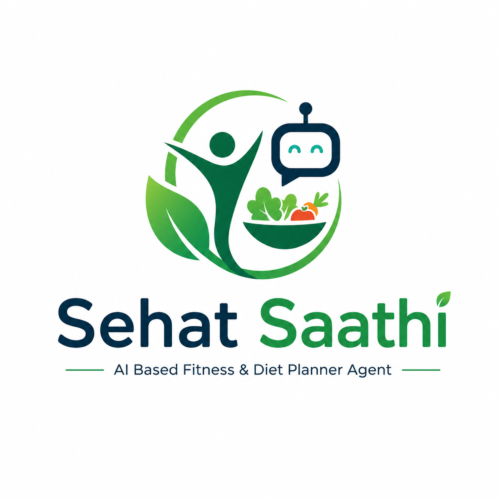

# Presentation Outline

## Slide 1: Title
Sehat Saathi
AI Based Fitness & Diet Planner Agent

## Slide 2: Problem
Why generic fitness apps fail on safety, personalization, and clarity.

## Slide 3: Product Goal
A premium, safe, and simple planner for workouts, meals, and progress.

## Slide 4: User Flow
Profile setup -> AI analysis -> workout plan -> meal plan -> progress tracking.

## Slide 5: Recommendation Engine
Rules for calorie targets, macros, exercise safety, and confidence scoring.

## Slide 6: Data Inputs
Age, weight, height, goal, activity level, diet preference, injuries, and allergies.

## Slide 7: Dashboard Design
Premium SaaS layout, clean cards, white space, Inter typography, and green accents.

## Slide 8: Workout Section
Weekly schedule, day selector, exercise cards, coaching tips, and progress summary.

## Slide 9: Meal Section
Meal cards, macro summary, nutrition score, insight boxes, and expandable details.

## Slide 10: Validation
Multiple sample profiles used to confirm calorie targets and safety rules.

## Slide 11: Future Scope
Wearables, better analytics, and deeper personalization.

## Slide 12: Conclusion
Sehat Saathi combines safety, clarity, and personalization in one health-tech product.
